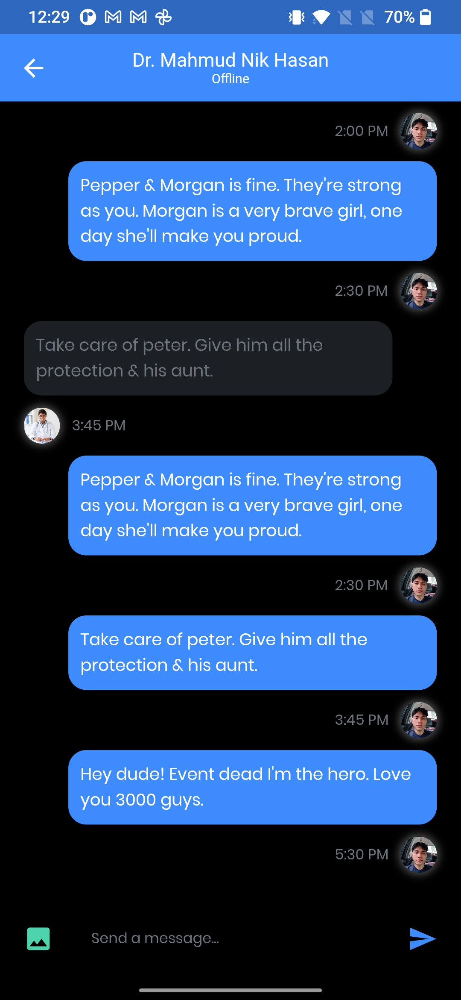

<!-- PROJECT Tittle and description -->

 <h1 align="center">TanyaDr
</h1>
  <h3 align="center">An application where you could consult a doctor. it allows user to search for doctors, chat with a doctor and view information about their symtoms</h3>

# Built With

 

# Preview 

 
 
 
 

 
 
 

